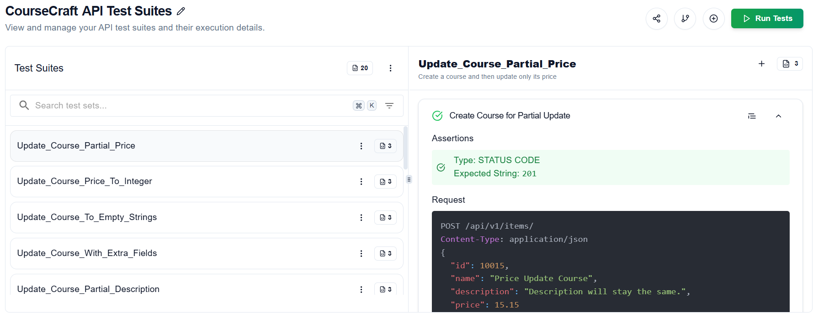
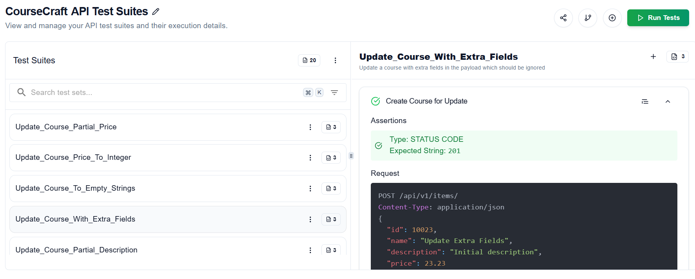

# CRUD API Server Python

This project is a full-stack CRUD (Create, Read, Update, Delete) web application for managing courses. It features a Python FastAPI backend, a PostgreSQL database, and a React + Vite frontend. The app is containerized using Docker and orchestrated with Docker Compose for easy setup and deployment.

## Tech Stack

- **Backend:** Python, FastAPI, SQLAlchemy
- **Database:** PostgreSQL
- **Frontend:** React, Vite, Tailwind CSS
- **Containerization:** Docker, Docker Compose

## Features

- RESTful API for managing course items (create, read, update, delete)
- Persistent PostgreSQL database
- Modern React frontend for interacting with the API
- Easy local development with Docker Compose

## Getting Started

### Prerequisites
- [Docker](https://www.docker.com/get-started) and Docker Compose installed

### Running the Application

1. **Clone the repository:**
   ```sh
   git clone https://github.com/V-Silpin/crud-api-server-python.git
   cd crud-api-server-python
   ```
2. **Start all services:**
   ```sh
   docker compose up --build
   ```
   This will start the PostgreSQL database, FastAPI backend (on port 8000), and React frontend (on port 3000).

3. **Access the app:**
   - Frontend: [http://localhost:3000](http://localhost:3000)
   - Backend API docs: [http://localhost:8000/docs](http://localhost:8000/docs)

### Stopping the Application
```sh
docker compose down
```

### API Test Suite Screenshots


